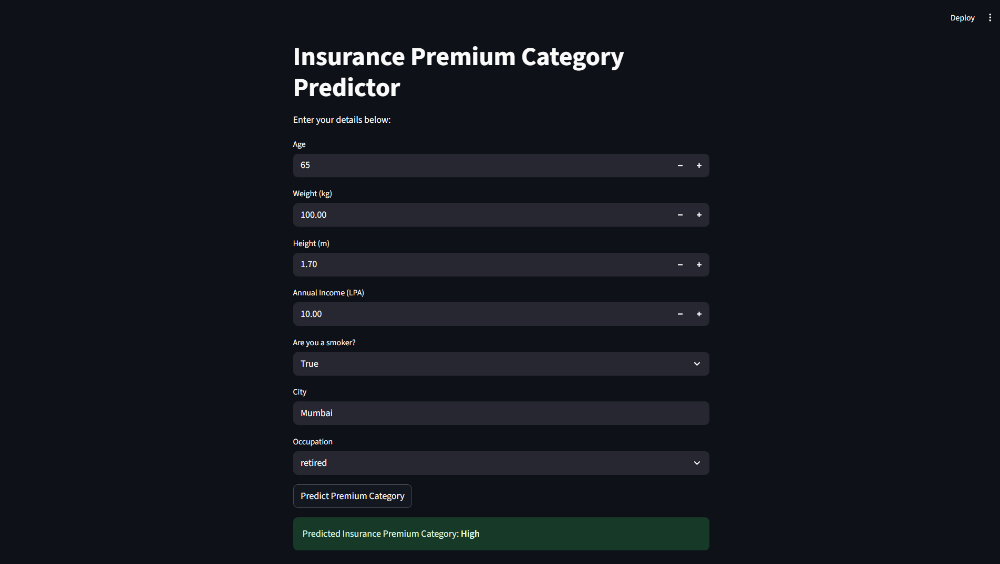

# 🚀 Insurance Premium Predictor

Welcome to the **Insurance Premium Predictor**! This project uses FastAPI and Streamlit to predict insurance premium categories based on user details and a trained machine learning model.

---

## 🌟 Features
- Fast and accurate insurance premium category prediction
- User-friendly web interface built with Streamlit
- REST API powered by FastAPI
- Machine learning model integration (scikit-learn)
- Modern, responsive design

---

## 🖥️ Demo


---

## 📦 Tech Stack
- **Backend:** FastAPI, scikit-learn, pandas
- **Frontend:** Streamlit
- **Model:** Trained with scikit-learn

---

## 🚦 How to Run

### 1. Clone the Repository
```bash
git clone https://github.com/rookiecoder910/Insurance-Premium-Predictor.git
cd Insurance-Premium-Predictor
```

### 2. Set Up Virtual Environment
```bash
python -m venv myenv
myenv\Scripts\activate
```

### 3. Install Dependencies
```bash
pip install -r requirements.txt
```

### 4. Start FastAPI Server
```bash
myenv\Scripts\uvicorn.exe app:app --reload
```

### 5. Run Streamlit Frontend
```bash
streamlit run frontend.py
```

---

## 📝 Usage
1. Enter your details in the Streamlit web app.
2. Click **Predict Premium Category**.
3. View your predicted insurance premium category instantly!

---

## 📊 Example Input
```json
{
  "age": 30,
  "weight": 65.0,
  "height": 1.7,
  "income_lpa": 10.0,
  "smoker": false,
  "city": "Mumbai",
  "occupation": "private_job"
}
```

---

## 🖼️ Screenshots
Add screenshots of your app here for better visualization.

---

## 🤝 Contributing
Contributions are welcome! Please open issues or submit pull requests for improvements.

---

## 📄 License
This project is licensed under the MIT License.

---

## 💡 Inspiration
Built for learning, experimentation, and real-world insurance premium prediction.

---

## 📬 Contact
For questions or feedback, reach out at [rookiecoder910](https://github.com/rookiecoder910).

---

> **Made with ❤️ using FastAPI, Streamlit, and scikit-learn**
